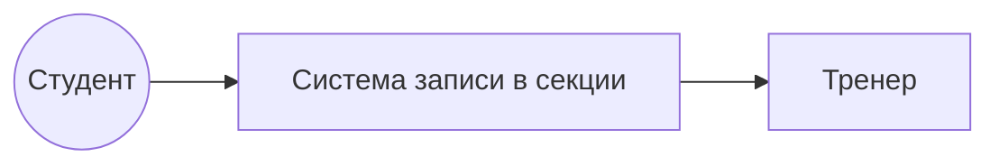

## Проблема и цель
Проблема: запись в секции идёт на бумаге и в чатах, тренеры не знают, кто придёт, места распределяются неравномерно.

Бизнес-цель (измеримая): к концу семестра 80% записей в секции проходят через систему, время записи студента — не более 1 минуты.

## Границы системы
Входит в систему: просмотр секций, запись и отмена записи, расписание, список участников, отметка посещаемости.

Не входит (внешние системы): учёт успеваемости, оплата, медицинские справки, сервис email-уведомлений.

## Заинтересованные стороны

| Стейкхолдер | Роль | Интересы / ожидания | Влияние | Интерес |
|---|---|---|---|---|
| Студент | Пользователь | Быстро записаться в секцию | Среднее | Высокий |
| Тренер | Пользователь | Видеть список участников и посещаемость | Среднее | Высокий |
| Заведующий ф/к | Заказчик | Больше охват студентов | Высокое | Высокий |
| Администрация колледжа | Спонсор | Отчеты по занятости | Высокое | Средний |
| Администрация системы | Поддержка | Стабильная работа | Низкое | Средний |

## Ограничения 

Срок: 1 семестр. Бюджет минимальный. Веб-приложение.
Закон о персональных данных (152-ФЗ): хранить минимум данных о студентах.

## Диаграмма контекста

## Глоссарий 

| Термин    | Определение                           |
| --------- | ------------------------------------- |
| Секция    | Спортивная группа по видам спорта (футбол , волейбол) |
| Занятия   | Одна тренировка секции в определенное время |
| Запись    | Факт участия студента в секции |
| Лимит мест | Максимум студентов в секции |
| Посещаемость | Отметка ,  был ли студент на занятии |

